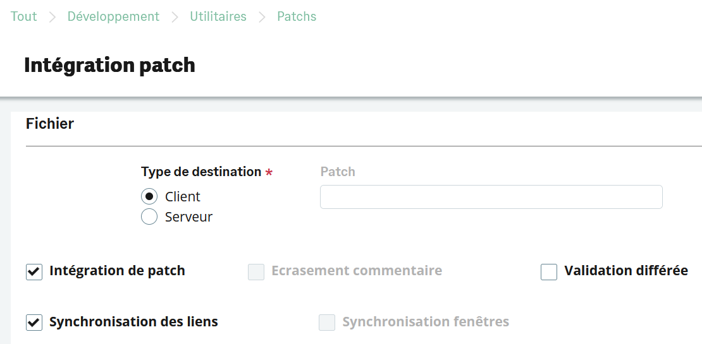
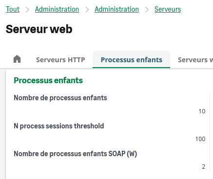
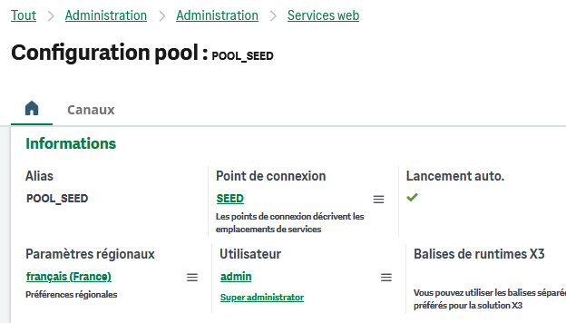
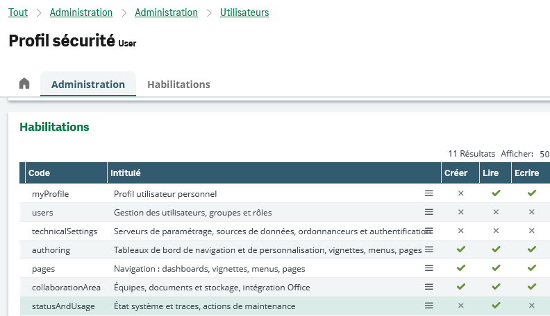
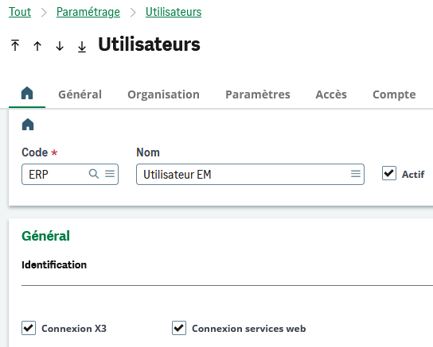
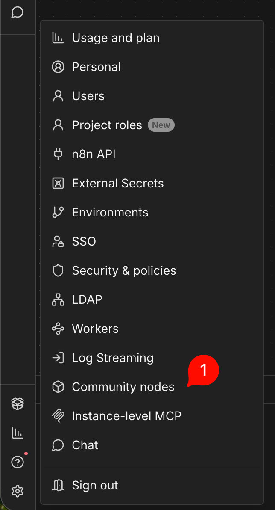
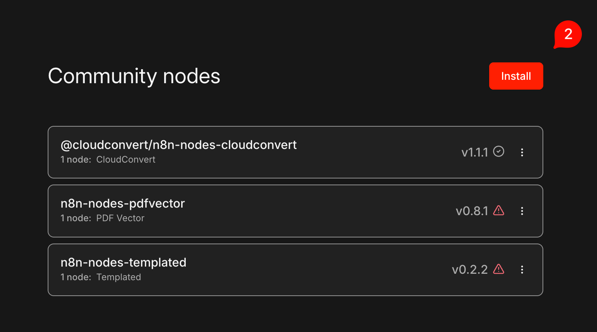
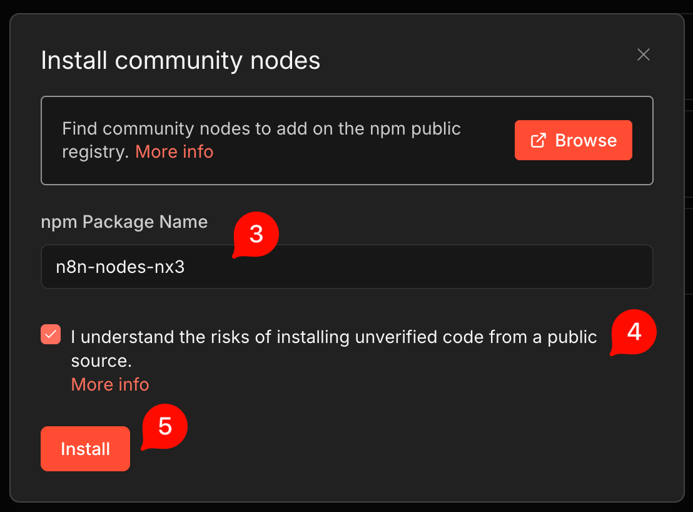
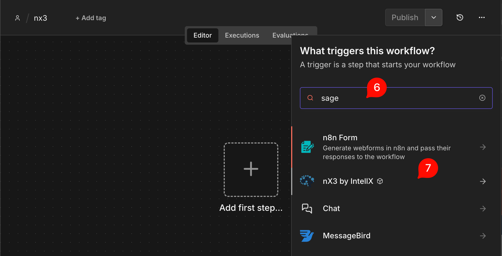
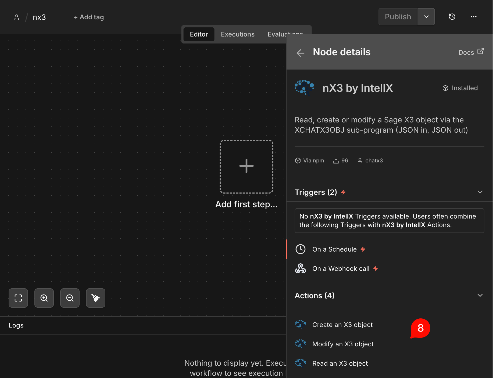

# n8n-nodes-nx3 — Intégration Sage X3 pour n8n

[](https://www.npmjs.com/package/n8n-nodes-nx3)
[](https://www.npmjs.com/package/n8n-nodes-nx3)
[](https://docs.n8n.io/integrations/community-nodes/)

**🇫🇷 Français** · [🇬🇧 English](README.en.md)

> Nœud communautaire **nX3 by IntellX** permettant d'orchestrer vos objets et traitements **Sage X3** directement depuis [n8n](https://n8n.io), via la passerelle **ChatX3**.

Ce nœud reproduit le comportement d'un utilisateur X3 (lecture, liste, création, modification d'objets) à travers les web services SOAP de Sage X3, en respectant intégralement les droits de l'utilisateur Syracuse et du dossier associés.

---

## Sommaire

- [Présentation](#présentation)
- [Prérequis](#prérequis)
- [1. Installation](#1-installation)
  - [1.1 Patch ChatX3](#11-patch-chatx3)
  - [1.2 Patch de licence n8n](#12-patch-de-licence-n8n)
  - [1.3 Pool de web services](#13-pool-de-web-services)
  - [1.4 Connectivité serveur X3 → ChatX3](#14-connectivité-serveur-x3--chatx3)
  - [1.5 Droits de l'utilisateur Syracuse](#15-droits-de-lutilisateur-syracuse)
  - [1.6 Droit web services de l'utilisateur X3](#16-droit-web-services-de-lutilisateur-x3)
  - [1.7 Installation du package dans n8n](#17-installation-du-package-dans-n8n)
- [2. Utilisation](#2-utilisation)
  - [Informations générales](#informations-générales)
  - [Formats attendus](#formats-attendus)
  - [Informations retournées](#informations-retournées)
  - [Fonctionnement technique](#fonctionnement-technique)
- [3. Actions disponibles](#3-actions-disponibles)
  - [READ — Lecture d'objet](#read--lecture-dobjet)
  - [LIST — Liste d'objet](#list--liste-dobjet)
  - [CREATE — Création d'objet](#create--création-dobjet)
  - [MODIFY — Modification d'objet](#modify--modification-dobjet)
- [Support](#support)

---

## Présentation

Les flux se déroulent **directement entre votre instance n8n et votre environnement Sage X3**. La passerelle ChatX3 ne sert qu'au contrôle de licence : **aucune donnée ni aucun identifiant n'est enregistré ou ne transite par ChatX3**.

| Caractéristique | Détail |
|-----------------|--------|
| Package npm | `n8n-nodes-nx3` |
| Nœud n8n | **nX3 by IntellX** |
| Protocole | Web services SOAP Sage X3 (Syracuse) |
| Périmètre | Objets et traitements **standards, verticaux et spécifiques** |
| Sécurité | Droits de l'utilisateur Syracuse et du dossier strictement respectés |

---

## Prérequis

Avant de commencer, assurez-vous de remplir les conditions suivantes :

- [ ] Le **patch ChatX3** est installé sur le dossier X3 ([§1.1](#11-patch-chatx3))
- [ ] Le **patch de licence n8n** personnalisé est installé ([§1.2](#12-patch-de-licence-n8n))
- [ ] Un **pool de web services** est créé, lancé et accessible depuis n8n ([§1.3](#13-pool-de-web-services))
- [ ] Le serveur Runtime X3 peut **joindre l'URL de licence ChatX3** ([§1.4](#14-connectivité-serveur-x3--chatx3))
- [ ] L'utilisateur Syracuse dispose du droit `statusAndUsage > Lire` ([§1.5](#15-droits-de-lutilisateur-syracuse))
- [ ] L'utilisateur X3 du dossier a le droit **Connexion services web** ([§1.6](#16-droit-web-services-de-lutilisateur-x3))
- [ ] Le package `n8n-nodes-nx3` est installé sur l'instance n8n ([§1.7](#17-installation-du-package-dans-n8n))

---

## 1. Installation

### 1.1 Patch ChatX3

1. Téléchargez le patch ChatX3 : **[📥 Télécharger le patch ChatX3](#)** <!-- TODO: remplacer par l'URL réelle -->
2. Dans Sage X3, ouvrez **Développement > Utilitaires > Patchs > Intégration de patchs (PATCH)**.
3. Reproduisez exactement les cases cochées de la capture ci-dessous, puis lancez l'intégration.

> **Chemin d'accès :** `Tout > Développement > Utilitaires > Patchs`



> [!TIP]
> Réalisez de préférence l'intégration d'abord sur un environnement de test, et conservez une sauvegarde du dossier avant toute opération.

---

### 1.2 Patch de licence n8n

Ce patch active la licence n8n personnalisée. Il s'installe **exactement comme le patch ChatX3** ([§1.1](#11-patch-chatx3)).

1. Téléchargez le patch n8n : **[📥 Télécharger le patch n8n personnalisé](#)** <!-- TODO: remplacer par l'URL réelle -->
2. Dans Sage X3, ouvrez **Développement > Utilitaires > Patchs > Intégration de patchs (PATCH)**.
3. Reproduisez les cases cochées de la capture ci-dessous, puis lancez l'intégration.


---

### 1.3 Pool de web services

Le pool de web services doit être **accessible publiquement ou depuis l'instance n8n**.

**a.** Vérifiez la présence d'**au moins un processus enfant SOAP** au niveau du serveur web Syracuse :



**b.** Créez et lancez un **pool de web services** sur le dossier concerné :



---

### 1.4 Connectivité serveur X3 → ChatX3

Afin de contrôler la licence ChatX3, une connexion est établie **aléatoirement une à deux fois par semaine**. L'URL suivante doit être accessible depuis votre **serveur Runtime X3** :

```
https://akfcgzazfvqipbjvdemn.supabase.co
```

> [!IMPORTANT]
> Si votre serveur X3 est derrière un proxy ou un pare-feu, autorisez cette URL en sortie. Sans cet accès, le contrôle de licence échouera.

---

### 1.5 Droits de l'utilisateur Syracuse

L'utilisateur Syracuse utilisé doit disposer, dans son profil de sécurité, du droit :

> `statusAndUsage` → **Lire**



---

### 1.6 Droit web services de l'utilisateur X3

L'utilisateur X3 du dossier, rattaché à l'utilisateur Syracuse, doit avoir le champ :

> **Connexion services web** → **Oui**



---

### 1.7 Installation du package dans n8n

**1.** Dans le menu de votre instance n8n, ouvrez **Paramètres > Community nodes**.



**2.** Cliquez sur le bouton **Install**.



**3.** Saisissez le nom du package npm `n8n-nodes-nx3`, cochez la case d'acceptation des risques, puis cliquez sur **Install**.



**4.** Pour vérifier l'installation, créez un nouveau workflow et recherchez **« sage »** dans la liste des nœuds.



**5.** Le nœud **nX3 by IntellX** doit apparaître avec ses actions disponibles.



> [!NOTE]
> L'installation de Community nodes peut nécessiter les droits administrateur sur l'instance n8n. Sur n8n Cloud, vérifiez que les Community nodes sont autorisés sur votre offre.

---

## 2. Utilisation

### Informations générales

- Les flux se déroulent entre votre instance n8n et votre environnement X3.
- **Aucune donnée et aucun identifiant** n'est enregistré ou ne transite par ChatX3.
- Les droits de l'utilisateur Syracuse et du dossier associés sont utilisés, garantissant un accès aux informations contrôlé.
- Les objets **standards, verticaux et spécifiques** de l'environnement sont pris en compte.
- Tous les traitements **standards, verticaux et spécifiques** sont exécutés comme si l'utilisateur saisissait manuellement.

### Formats attendus

- Le nœud attend un **flux JSON** contenant les abréviations des écrans et les champs à utiliser.
- Tous les champs sont considérés comme **dimensionnés** : ils doivent donc être des **collections** (tableaux) dans le JSON.
- Pour cibler une dimension précise, ajoutez l'indice `(X)` dans le nom du champ.
- Il n'est **pas** nécessaire de renseigner les variables de bas de tableau dans les blocs tableaux.
- Les dates sont au format alphanumérique **`YYYY-MM-DD`** (année-mois-jour).
- Pour **vider** un champ : date `"0000-00-00"`, entier `0` ou chaîne vide `""`.

Exemples de syntaxe de champs :

```json
"TSICOD": ["20", "21", "99"]
"TSICOD(1)": "21"
"SBSDAT": ["2026-05-01"]
```

### Informations retournées

- Toutes les informations nécessaires sont renvoyées dans un **flux JSON**.
- Tous les **messages utilisateur X3** sont renvoyés dans un JSON.
- Un booléen **`success`** (`true`/`false`) indique si l'action demandée a bien été réalisée.
- En cas de succès, le flux JSON des écrans et champs lus/saisis **après l'opération** est renvoyé.
- Une **trace X3** classique est toujours créée ; son nom est transmis dans les messages.

**Exemple de messages JSON :**

```json
{
  "messages": [
    { "info": "Message d'info" },
    { "error": "Message d'erreur" },
    { "alert": "Message d'avertissement" }
  ]
}
```

**Exemple de trace :**

```json
{
  "trace": "F64723"
}
```

### Fonctionnement technique

Dans le contexte des appels n8n, les variables X3 suivantes sont positionnées :

| Variable | Valeur |
|----------|:------:|
| `[V]GXCHATX3OBJ` | `1` |
| `[V]GSERVEUR` | `0` |
| `[V]GBATCH` | `0` |
| `[V]GWEBSERV` | `1` |
| `[V]GIMPORT` | `0` |

> [!WARNING]
> Les objets et actions appelés **ne doivent pas ouvrir de fenêtres supplémentaires** au-delà de celles de l'action ou de l'objet de base appelé.

---

## 3. Actions disponibles

| Action | Description |
|--------|-------------|
| [`READ`](#read--lecture-dobjet) | Lire un enregistrement existant |
| [`LIST`](#list--liste-dobjet) | Lister les enregistrements avec sélection avancée |
| [`CREATE`](#create--création-dobjet) | Créer un nouvel enregistrement |
| [`MODIFY`](#modify--modification-dobjet) | Modifier un enregistrement existant |

---

### READ — Lecture d'objet

Permet de lire un enregistrement pour un objet X3.

> **Exemple (dossier SEED)** — Objet `GAS`, transaction `1PAGE`, identifiant `SMDIV~FR0120104SMDIV000001`

**Flux d'appel :**

```json
{}
```

**Flux JSON obtenu :**

```json
{
  "HAE1": {
    "ACC1": ["608801", "486000"],
    "ACCDAT": ["2024-04-01"],
    "ACCDES": ["Assurance facturée", "Charges constatées d'avance"],
    "AMT1": [1000, 1000],
    "CAT": [2],
    "CPY": ["FR10"],
    "CUR": ["EUR"],
    "FCY": ["FR012"],
    "JOU": ["ODDIV"],
    "NBLIG": [2],
    "NUM": ["FR0120104SMDIV000001"],
    "NUMLIG": [1, 2],
    "TYP": ["SMDIV"],
    "TOTCDT": [1000],
    "TOTDEB": [1000],
    "VALDAT": ["2024-04-01"]
  }
}
```

**Messages JSON obtenus :**

```json
{
  "messages": [
    { "trace": "F64843" }
  ],
  "success": true
}
```

---

### LIST — Liste d'objet

Permet d'obtenir les informations de la liste gauche principale de l'objet via une **sélection avancée**. Les listes sont filtrables, via le flux JSON, sur n'importe quel champ de la table principale. Par défaut, le nombre d'éléments renvoyés est `[V]GNBGAUCHE` ou `100`.

> **Exemple (dossier SEED)** — Objet `SOH`, transaction `ALL`

**Flux d'appel :**

```json
{
  "list_nb": 10,
  "list_filters": "[F:BPA]CRY<>\"FR\" & [F:SOH]CUSORDREF<>\"\""
}
```

**Flux JSON obtenu :**

```json
{
  "table_count": 1193,
  "list_count": 10,
  "filters": {
    "CRITERE(0)": "1=1",
    "FILTSUP(0)": "SOHCAT < 4",
    "FILRAP(0)": "[F:BPA]CRY<>\"FR\" & [F:SOH]CUSORDREF<>\"\""
  },
  "codes": [
    "[F:SOH]SOHNUM",
    "[F:SOH]BPCORD",
    "[F:SOH]ORDDAT",
    "[F:SOH]CUSORDREF",
    "[F:SOH]DLVSTA"
  ],
  "titles": [
    "No commande",
    "Client commande",
    "Date commande",
    "Référence",
    "Etat livraison"
  ],
  "values": [
    ["SOWDE0120012", "DE001", "2025-07-21", "WEB015182112", 1],
    ["SOWDE0120011", "DE001", "2025-12-21", "WEB015182112", 2],
    ["SOWDE0120010", "DE001", "2025-11-09", "WEB015180911", 2]
  ]
}
```

**Messages JSON obtenus :**

```json
{
  "messages": [
    { "trace": "F64837" }
  ],
  "success": true
}
```

---

### CREATE — Création d'objet

Permet de créer un nouvel enregistrement pour un objet X3 (hors objets de type tableau).

> **Exemple (dossier SEED)** — Création d'un devis `SQH`

**Flux d'appel :**

```json
{
  "SQH0": {
    "BPCORD": ["FR001"],
    "SALFCY": ["FR021"],
    "SQHTYP": ["SQN"]
  },
  "SQH1": {
    "STOFCY": ["FR021"],
    "VACBPR": ["FRA"]
  },
  "SQH2": {
    "GROPRI": [1000],
    "ITMREF": ["ASS001"],
    "QTY": [1]
  }
}
```

**Flux JSON obtenu :**

```json
{
  "SQH0": {
    "BPCNAM": ["Urban Cycle"],
    "BPCORD": ["FR001"],
    "CUR": ["AED"],
    "QUODAT": ["2026-05-28"],
    "SALFCY": ["FR021"],
    "SQHNUM": ["FR0212605SQN00000001"],
    "SQHTYP": ["SQN"]
  }
}
```

**Messages JSON obtenus :**

```json
{
  "messages": [
    { "trace": "F64842" },
    { "info": "Objet créé : FR0212605SQN00000001" },
    { "alert": "Accès non autorisé sur cet article (Elaboration)" }
  ],
  "success": true
}
```

---

### MODIFY — Modification d'objet

Permet de modifier un enregistrement pour un objet X3.

> **Exemple (dossier SEED)** — Objet `SOH`, transaction `STD`, identifiant `SOWFR0110003`

**Flux d'appel :**

```json
{
  "SOH4": {
    "QTY(1)": [7]
  }
}
```

**Flux JSON obtenu :**

```json
{
  "SOH0": {
    "BPCNAM": ["Micro Systems"],
    "BPCORD": ["FR004"],
    "CUR": ["EUR"],
    "CUSORDREF": ["Test report ACCINV"],
    "ORDDAT": ["2026-05-22"],
    "SALFCY": ["FR011"],
    "SOHNUM": ["SOWFR0110003"],
    "SOHTYP": ["WEB"]
  },
  "SOH4": {
    "ITMREF": ["DIS009", "DIS007"],
    "QTY": [1, 7],
    "GROPRI": [220, 250],
    "NBLIG": [2]
  }
}
```

**Messages JSON obtenus :**

```json
{
  "messages": [
    { "trace": "F64844" },
    { "alert": "Désirez vous recalculer les prix et remises ?   (Non)" }
  ],
  "success": true
}
```

---

## Support

Une question, un bug ou une demande d'évolution ?

- 🐛 **Bug / évolution** : ouvrez une [issue GitHub](../../issues)
- 💬 **Contact** : [contact@intellx.chat](mailto:contact@intellx.chat)
- 🌐 **Site** : [https://intellx.chat](https://intellx.chat)

Avant d'ouvrir une issue, vérifiez que tous les [prérequis](#prérequis) sont remplis et joignez si possible le **nom de la trace X3** renvoyée dans les messages.

---

<p align="center"><sub>nX3 by IntellX — Intégration Sage X3 pour n8n</sub></p>
